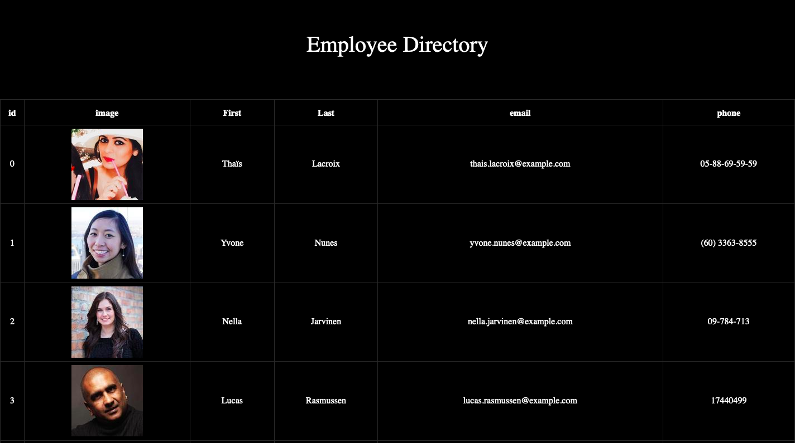

# Employee Directory

## Usage

Given a table of random users generated from the [Random User API](https://randomuser.me/), when the user loads the page, a table of employees should render. 

The user should be able to:

  * Sort the table by at least one category

  * Filter the users by at least one property.

  

## Github

https://github.com/legit-jb/employee-directory

## Deployed Link

https://legit-jb.github.io/employee-directory

